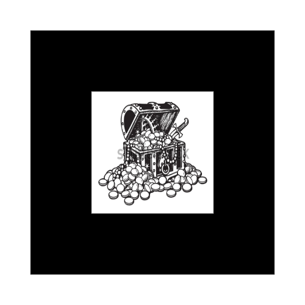

🧭 Laboratorio: Búsqueda del Tesoro en Realidad Aumentada (AR.js)
1. 🧠 Objetivos
Comprender cómo funciona la realidad aumentada basada en marcadores.
Integrar lógica de juego en JavaScript (detección de marcadores, progreso, feedback).
Trabajar colaborativamente en el diseño de una experiencia digital creativa.
2. 🎯 Descripción
En este proyecto, tu equipo deberá desarrollar una experiencia de Realidad Aumentada (AR) utilizando AR.js y A-Frame, creando un juego tipo “búsqueda del tesoro” ambientado en el Edificio Sacré Coeur.

La idea es que los jugadores, usando la cámara del celular o notebook, puedan escanear marcadores físicos distribuidos en diferentes puntos y descubrir pistas visuales o modelos 3D que los guíen hasta un “tesoro virtual”.

3. ⚙️ Requerimientos técnicos
Proyecto web que funcione en navegador (sin necesidad de app nativa).
Uso de AR.js y A-Frame (última versión estable).
Al menos 3 marcadores AR diferentes.
Cada marcador debe mostrar un elemento o pista diferente.
Al encontrar todos los marcadores, el usuario debe recibir algún tipo de retroalimentación final (mensaje, animación, sonido, etc.).
El código debe estar publicado en GitHub Pages o en un servidor accesible desde el celular.
4. 🗺️ Dinámica sugerida del juego
Los jugadores comienzan escaneando un marcador inicial que presenta la historia o el desafío.
A medida que encuentran nuevos marcadores, se van desbloqueando pistas o elementos visuales.
Al completar todos los pasos, se revela el tesoro o final de la historia.
5. 📦 Entregables
El único entregable es una URL donde se aloja el juego, puede ser en Azure o Github Pages, pero hay tres beta testers de este juego: Bruno, Maxi y Gonzalo. La evaluación depende de que ellos pueda encontrar el tesoro en las próximas semanas.
6. 🧩 Pistas para el desarrollo
Sugerencias:

Revisar la documentación oficial de AR.js → https://ar-js-org.github.io/AR.js/
Explorar ejemplos con A-Frame + AR.js.
Probar diferentes tipos de entidades (a-plane, a-box, a-text, a-entity con modelos 3D).
Agregar interactividad con eventos JavaScript (markerFound, markerLost).
Explorar la creación de nuevos patrones para los marcadores.
7. 💡 Desafíos opcionales
Agregar efectos de sonido o animaciones al encontrar pistas.
Implementar contador de tiempo o progreso del jugador.

## 🛠 Cómo probar el juego paso a paso

1. Inicia un servidor local en `8080` (por ejemplo `python3 -m http.server 8080` o `npx http-server . -p 8080`).
2. En otra terminal, arranca el proxy HTTPS con:  
   `npx local-ssl-proxy --source 8443 --target 8080 --hostname 0.0.0.0`
3. Desde el celular (misma red), abrí `https://<ip-de-tu-mac>:8443` y aceptá el certificado inseguro. Una vez que cargue la cámara, ya puedes escanear los marcadores.
4. Cada vez que encuentres un marcador, el HUD marcará el progreso; al completar los tres, se mostrará el mensaje final y sonará la animación de cierre.

> Si el proxy no arranca y aparece `EADDRINUSE`, cerrá cualquier instancia previa con `Ctrl+C` y volvé a ejecutar el comando.

## 🖨 Marcadores listos para imprimir

Imprimí los siguientes marcadores en tamaño A4 o mostrálos en pantalla. Todos están configurados como `type="pattern"` y viven en la carpeta `makers/`:

- **Marcador Inicial – Foto patrón personalizada**  
  

- **Marcador León – Guardian felino**  
  

- **Marcador Tesoro – Cofre final**  
  

> Tip: si necesitás recalibrar un patrón, podés abrir el generador oficial de AR.js (`https://jeromeetienne.github.io/AR.js/three.js/examples/marker-training/examples/generator.html`), cargar la imagen y exportar un nuevo `.patt`.

## 🚀 Publicar el proyecto en GitHub Pages

Este repositorio ya incluye un workflow (`.github/workflows/deploy.yml`) que envía automáticamente el contenido estático a GitHub Pages cada vez que se hace push a `main`. Solo resta activarlo desde la configuración del repo:

1. Entrá a **Settings → Pages**.
2. En **Build and deployment → Source**, elegí **GitHub Actions**. Guardá los cambios.
3. Hacé push a `main` (`git push origin main`). El workflow `Deploy to GitHub Pages` se dispara y publica el sitio.
4. Cuando finalice, GitHub mostrará la URL pública (algo como `https://<usuario>.github.io/<repo>/`). Compartí ese enlace para que cualquiera pueda probar la experiencia AR sin necesidad de tu server local.

> Nota: asegurate de commitear solo los archivos necesarios (`index.html`, carpeta `makers/`, etc.). La carpeta `node_modules/` está ignorada para que el despliegue siga siendo liviano.
